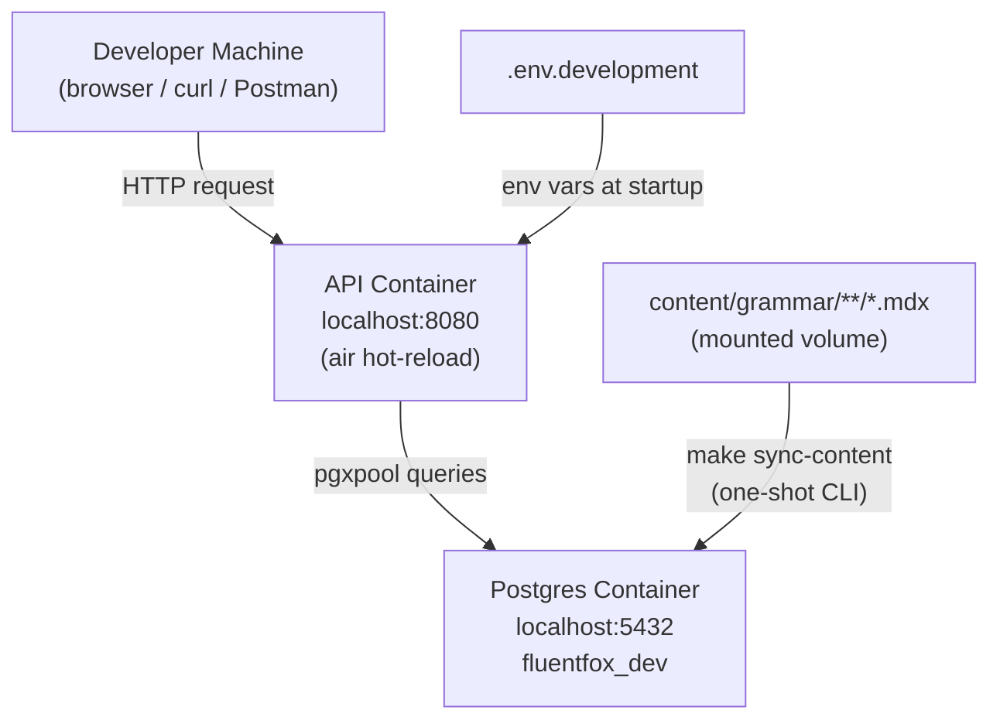
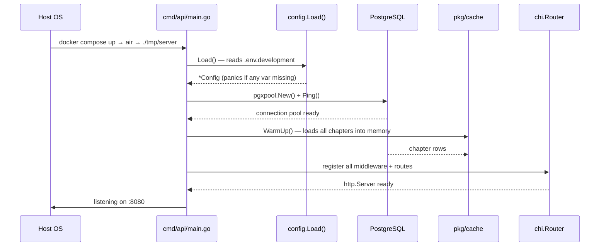
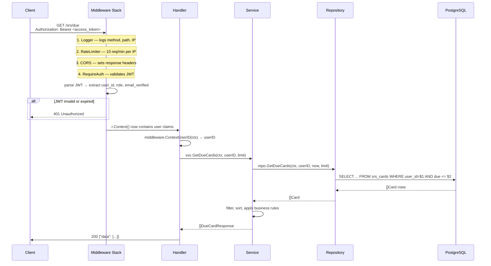
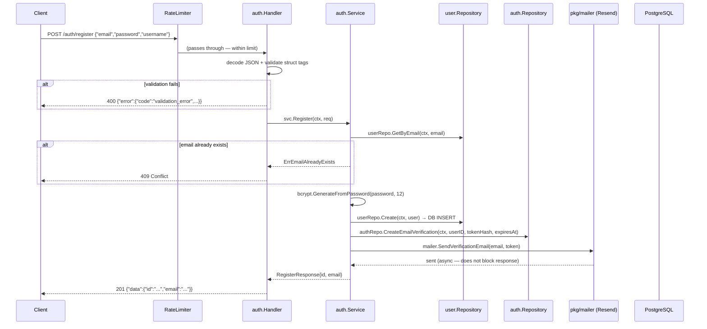
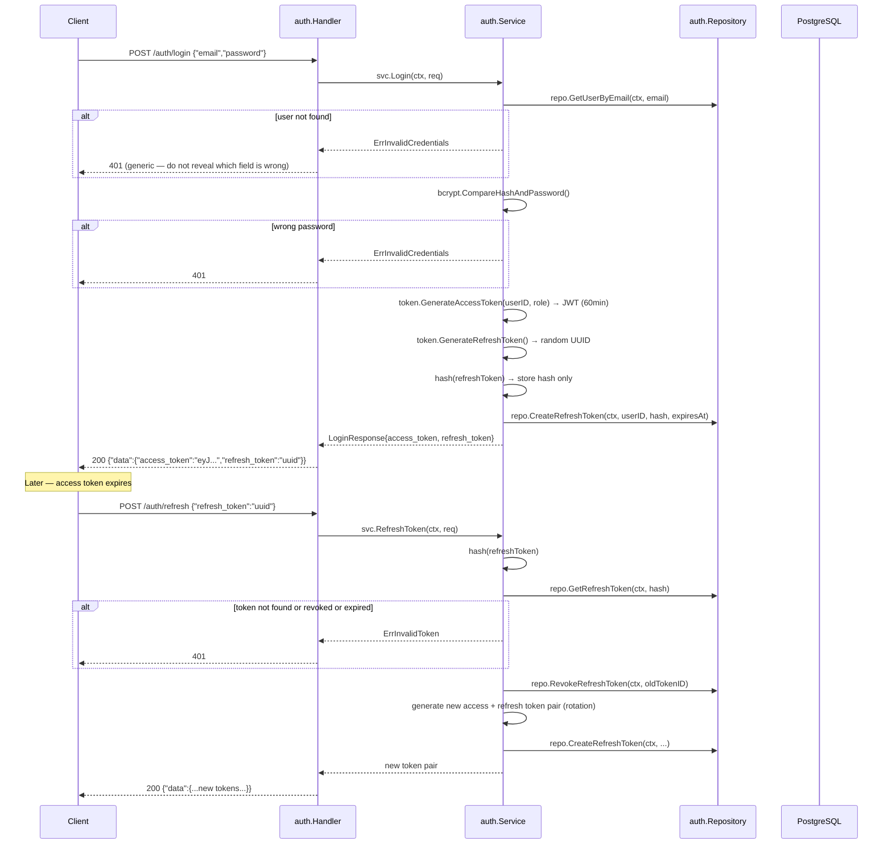
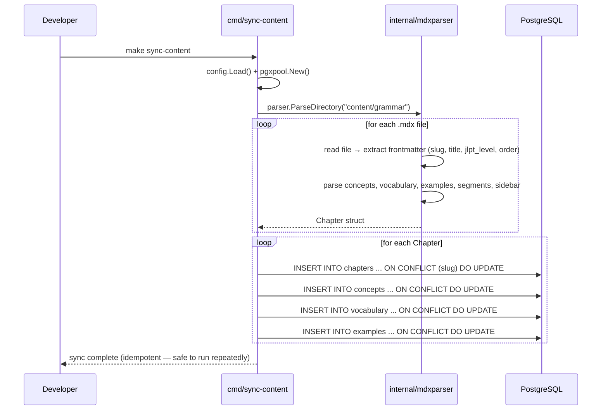
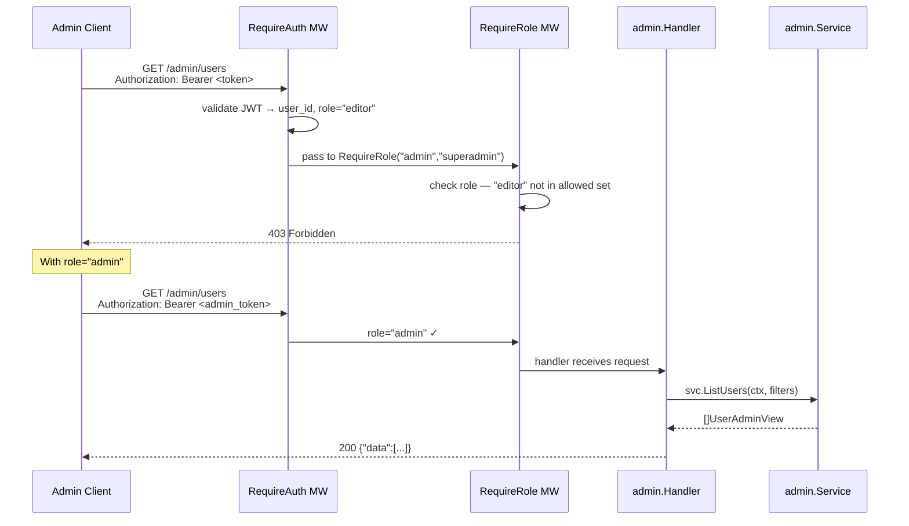
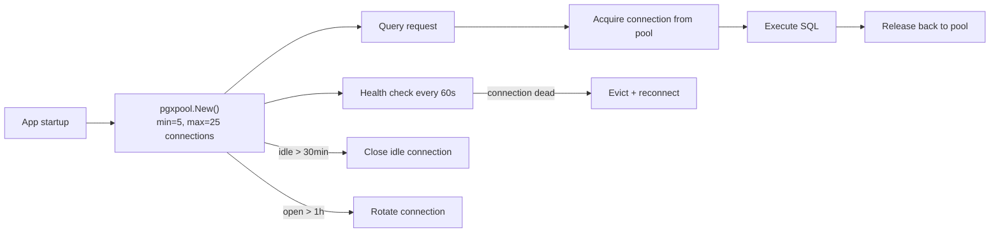

# Request & Data Flow (Development)

This document shows how data moves through the system. All diagrams reflect the **local development** setup — Docker Compose + hot reload. Production routing (Railway, TLS, etc.) is not covered here.

---

## Development Environment Topology

Both containers are started with `make dev` (`docker compose up`). Source code is bind-mounted into the API container, so `air` detects file changes and rebuilds without restarting Docker.

---

## Startup Sequence

If `config.Load()` panics, the container exits immediately — check `.env.development` for missing variables.

---

## Authenticated Request Flow

This is the path for any route that requires a logged-in user (e.g., `GET /srs/due`).

---

## Authentication Flow — Register

---

## Authentication Flow — Login & Token Refresh

---

## Content Sync Flow (MDX → Database)

This is a one-shot CLI command, not an HTTP request. Run it whenever MDX files change.

---

## Admin Request Flow

Admin routes require both a valid JWT **and** the role `admin` or `superadmin`. Two middleware layers enforce this.

---

## Data Layer — pgxpool Connection Lifecycle

Connection limits are set via env vars (`DB_MAX_CONNS=25`, `DB_MIN_CONNS=5`). Adjust these based on your Postgres plan's connection limit.
